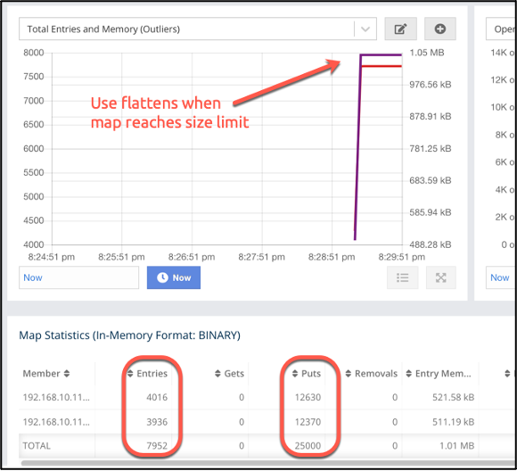
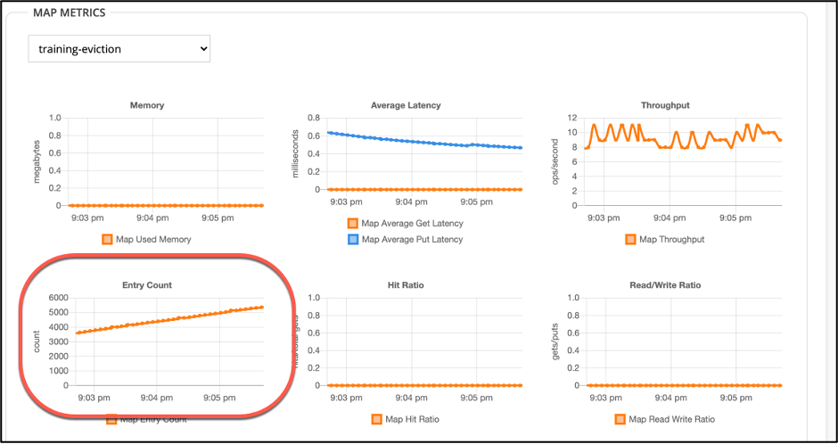
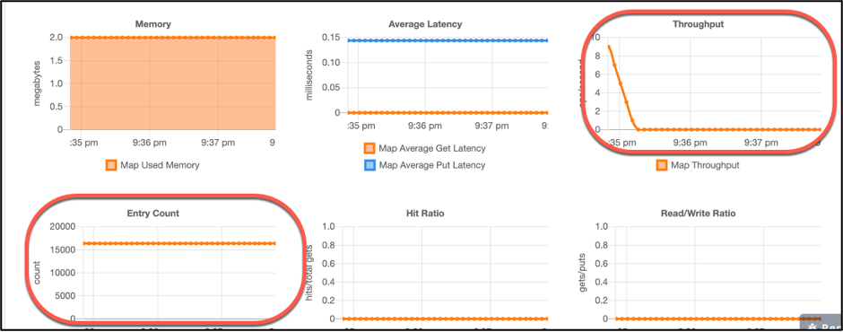

# Eviction

## Objective
* Observe the effect of eviction on a map.

## Local Cluster

> Note: scroll down for cloud-based instructions

Recall that in the lab setup, you added a configuration for the map called training-eviction.
 ```
    <map name="training-eviction">
        <eviction eviction-policy="LFU" max-size-policy="USED_HEAP_SIZE" size="1"/>
     </map>
 ```
This configuration limits the map to using no more than 1% of the total heap memory available.

We’re now going to run a client that fills this map past capacity and observe as eviction limits the map size.

1.	Open Management Center.

2.	Open the Client file. Modify the configuration as needed to connect to your cluster. 

    a. The client creates the map called training-eviction.
    
    b. The client populates the map with 25000 entries.

3.	Run the client. When the client is finished, note the number of entries available in the map. It should be significantly less than 25000, depending on the total memory available to your local cluster. 

4.	In Management Center, click on `Maps` on the left side of the screen, then click on `training-eviction` to open a dashboard for the specific map.



Note that the usage graph rises at a constant rate, then flattens out as the map reaches the configured maximum capacity.

You can see from the statistics that all 25000 entries were written to the map, but only a subset are currently in the map. Eviction removed the rest.

### Additional Practicee

1. Open the console window in Management Center.

2.	Change the name space to training-eviction
```
$ ns training-eviction
```
2.	Display all the entries in the map
```
$ m.entries
```
3.	Use `m.get` and `m.put` to display and add individual entries to the map.

4.	Type help to see what other functions are available via the console.

> Note: The Management Center console is a quick way to test data structure functionality without having to re-run client code.


## Cloud-based Cluster

Recall that in the lab setup, you added a configuration for the map called training-eviction. You set the policy to evict least frequently used entries (LFU), and limited the map size to no more than 1% of the total heap memory available.

We’re now going to run a client that fills this map past capacity and observe as eviction limits the map size.

1.	Open the Client file. Modify the configuration as for Lab 1 to connect to your cloud cluster.

    a.	The client creates the map called training-eviction.
    
    b.	This client populates the map with 25000 entries.

2.	Run the client. Go get a cup of your favorite beverage - this may take a while. (Actual performance will depend on the speed of your connection to the cloud. Remember, you’re using a free implementation – performance isn’t optimal.)

3.	While you are waiting, you can use the cloud console to observe the map memory utilization slowly climbing as entries are added to the map.
 
 

Eventually, the memory utilization number will level out at a fixed count, and throughput will drop to 0. This indicates that you are no longer adding new entries to the map. You’ll also note that the memory used by the map maxed out at 2.0 megabytes – one percent of the 200 MB available to a free cloud cluster.

 


### Extra Practice

Start a second client that pulls entries from the map. You may have to try several keys to get a valid one. Note that invalid keys – keys that have been removed from the map – return a null.  


