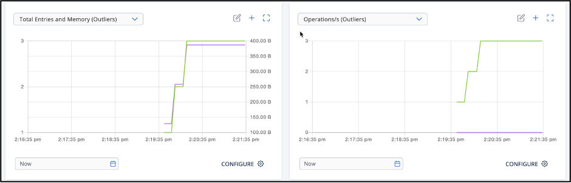

# Lab 2: In-Memory Storage

## Objectives

- Use SQL Shell to create a map, add data, and retrieve data 
- Add a second cluster member
- Use Management Center to monitor cluster operations
- Connect a client application to the Hazelcast cluster


## Part 1: SQL Shell

1. Use the following command to open the SQL shell.

- Linux/Mac
```
bin/hz-cli sql
```

- Windows
```
bin\hz-cli.bat sql
```

2. Complete the SQL Maps tutorial located here: https://docs.hazelcast.com/hazelcast/latest/sql/get-started-sql

3. In Management Center, go to **Storage > Maps**. You’ll see the map you just created listed. Click on the name of the map. Scroll through to see details on map operations. You should see something similar to the screen below, showing the activity and usage increase as you added each map entry. 

	

## Part 2: Add A Cluster Member

1. Open a new terminal window and start a second instance of Hazelcast.
```
hz start
```
2. Open Management Center and observe as the second instance starts, the cluster forms, and distributes the stored data across both members.

3. In Management Center, go to Storage > Maps. Note that the entries from the maps you created in Part 1 are distributed across both members. 

## Part 3 (Optional): Connect a Client

This lab includes a sample client program in Java. If you want to use a different language, go to https://docs.hazelcast.com/hazelcast/latest/clients/hazelcast-clients for instructions on setting up the client for your language.

1. Open FillMapClient in your preferred Java IDE. 
- The code opens a client connection to Hazelcast, creates a map called RandomNumbers, then begins populating the map with randomly generated numbers. 
- The program loops continuously, so you will need to manually stop the program after completing the steps.

2.	In Management Center, go to Cluster>Client. Check out the connection from your client application.

3.	Save your client code for use with the Getting Started with Hazelcast Cloud exercise.


