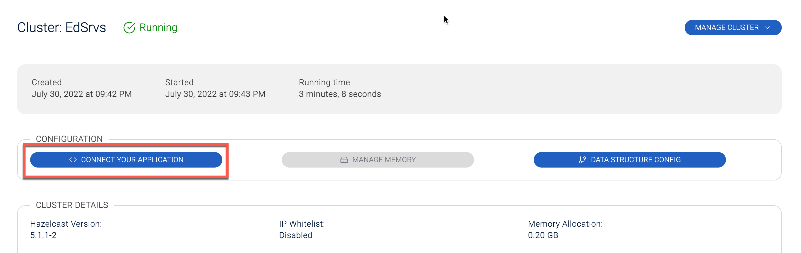

# Lab 4: Hazelcast Cloud

1. Go to https://docs.hazelcast.com/cloud/getting-started and follow the instructions to set up your cloud cluster.

2. In the cloud dashboard, select the **Connect Your Application** button. Follow the instructions for your preferred language. 

